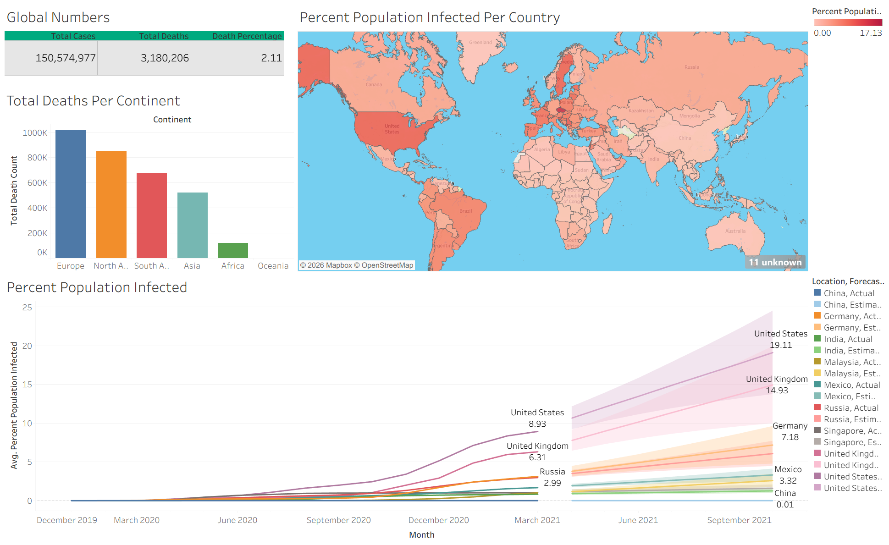

# COVID-19 Data Exploration and Analysis Using SQL and Tableau

## Project Overview

This end-to-end data analytics project explores global COVID-19 cases, deaths, population figures, infection rates and vaccination progress.

Microsoft SQL Server was used to query, aggregate and analyse the source data. Selected SQL query results were exported to Excel and used to create an interactive dashboard in Tableau.

The dataset covers the period from **1 January 2020 to 30 April 2021** and contains information for **219 locations**.

## Dashboard



### Interactive Dashboard

[View the interactive dashboard on Tableau Public](https://public.tableau.com/app/profile/kiran.raj1902/viz/Covid19TableauDashboard_17853869503780/Dashboard1?publish=yes)

The dashboard presents:

- Global reported COVID-19 cases
- Global reported COVID-19 deaths
- Global case fatality rate
- Total deaths by continent
- Percentage of population infected by country
- Actual and forecasted infection trends for selected countries

> The dashboard reflects historical data available through 30 April 2021 and should not be interpreted as current COVID-19 statistics.

## Project Workflow

1. Downloaded the COVID-19 datasets from Our World in Data.
2. Imported the datasets into Microsoft SQL Server.
3. Explored and analysed the data using SQL.
4. Calculated global cases, deaths and infection rates.
5. Compared COVID-19 outcomes across countries and continents.
6. Joined deaths and vaccination data using location and date.
7. Exported selected query results to Excel workbooks.
8. Connected the exported workbooks to Tableau.
9. Created and published an interactive Tableau dashboard.

## Project Objectives

The main objectives were to:

- Compare total COVID-19 cases with total deaths
- Calculate the percentage of the population infected
- Identify countries with the highest infection rates
- Identify countries with the highest reported death counts
- Compare COVID-19 deaths across continents
- Calculate global case and death figures
- Track cumulative vaccinations by country
- Visualise geographical and time-series trends
- Produce an interactive Tableau dashboard

## Dataset

The project uses two source datasets:

- `CovidDeaths.csv` — cases, deaths, population, hospitalisation and location data
- `CovidVaccinations.csv` — testing, vaccination, demographic, economic and healthcare data

The files contain approximately 85,000 records each.

Original data source: [Our World in Data COVID-19 Dataset](https://ourworldindata.org/covid-deaths)

## Tools Used

- Microsoft SQL Server
- SQL Server Management Studio
- Tableau Public
- Microsoft Excel

## Skills Demonstrated

### SQL

- Joins
- Common Table Expressions
- Temporary tables
- Window functions
- Aggregate functions
- Data type conversion
- Views
- Filtering and sorting
- Grouping
- Percentage calculations

### Tableau

- Dashboard development
- Geographic visualisation
- Time-series analysis
- Forecasting
- Calculated fields
- Data labels and tooltips
- Dashboard layout and formatting
- Publishing through Tableau Public

## SQL Analysis

### 1. Total Cases vs Total Deaths

Calculated the percentage of reported COVID-19 cases that resulted in recorded deaths.

### 2. Total Cases vs Population

Calculated the percentage of each country's population with recorded COVID-19 infections.

### 3. Countries with the Highest Infection Rates

Compared each country's highest recorded case count against its population.

### 4. Countries with the Highest Death Counts

Identified countries with the highest cumulative reported COVID-19 deaths.

### 5. Death Counts by Continent

Compared recorded death totals across continents.

### 6. Global COVID-19 Figures

Calculated total reported cases, total reported deaths and the global case fatality rate.

### 7. Population vs Vaccinations

Joined the deaths and vaccination datasets using location and date. A window function was used to calculate cumulative vaccinations for each country.

### 8. Vaccination Percentage

Used a Common Table Expression and temporary table to calculate vaccination totals relative to population.

### 9. SQL View

Created the `PercentPopulationVaccinated` view for later analysis and visualisation.

## Tableau Dashboard

Four SQL queries were used to prepare the datasets required for the dashboard:

1. Global case, death and fatality figures
2. Total deaths by continent
3. Percentage of population infected by country
4. Infection percentages over time for actual and forecasted analysis

The query results were exported to Excel before being connected to Tableau.

## Key Findings

Based on data through 30 April 2021:

- Approximately **150.6 million reported COVID-19 cases** were recorded globally
- Approximately **3.18 million reported deaths** were recorded globally
- Recorded deaths represented approximately **2.11% of reported cases**
- The United States had the highest recorded death count in the dataset
- Andorra had one of the highest recorded infection rates relative to population
- Europe had the highest recorded continental death total in the dashboard
- Infection rates and trends varied considerably across countries

## Repository Structure

```text
covid-19-sql-tableau-analysis/
│
├── README.md
│
├── Data/
│   ├── Raw/
│   │   ├── CovidDeaths.csv
│   │   └── CovidVaccinations.csv
│   │
│   └── Tableau Exports/
│       ├── Tableau Table 1 (Global Numbers).xlsx
│       ├── Tableau Table 2 (Deaths by Continent).xlsx
│       ├── Tableau Table 3 (Infection Rates by Country).xlsx
│       └── Tableau Table 4 (Infection Forecast).xlsx
│
├── SQL/
│   ├── Covid 19 Data Exploration.sql
│   └── Tableau SQL Query.sql
│
└── Tableau/
    ├── Covid 19 Dashboard Preview.png
    └── Covid 19 Tableau Dashboard.twbx
```

## How to Use This Repository

### SQL analysis

1. Download or clone the repository.
2. Create a SQL Server database.
3. Import the two CSV datasets as `CovidDeaths` and `CovidVaccinations`.
4. Open the SQL scripts using SQL Server Management Studio.
5. Run the queries individually.

### Tableau dashboard

1. Download `covid_19_tableau_dashboard.twbx`.
2. Open the packaged workbook using Tableau Desktop or Tableau Public.
3. Alternatively, use the Tableau Public link above to view the interactive dashboard online.

## Author

**T Kiranraj**
